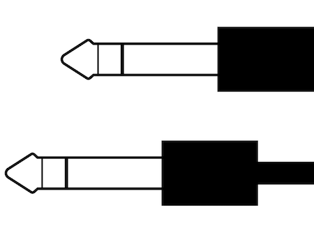

# PatchBay

---



PatchBay is a dead-simple declarative web framework built for Bun. Just like Bun itself, PatchBay is in infancy –
but as Bun grows, so too will PatchBay.

## Cookies

PatchBay supports cookies right out of the box... with an important caveat.

As a current limitation of the Fetch specification, only a single `Set-Cookie` header can be set in a `Response`.
While some platforms/environments have non-standard fixes for this, Bun sticks to the spec – so, to get around this
limitation, PatchBay exposes a home-rolled and easy-to-use cookie API for you, which under the hood maintains a single
cookie called `__PBCookie` containing JSON text of all the cookies you set.

To parse this and set the individual cookies client-side, you just need to add the following minimized
snippet to the head of your HTML page (a bundler script that rolls this into your static assets with WebPack is on the
roadmap).

```html
<script type="text/javascript">
    window.updateFromPBCookie=(()=>{let o=document.cookie.split("; ").find(o=>o.startsWith("__PBCookie="));if(!o)return;o=o.replace("__PBCookie=","");const e=JSON.parse(o);for(k in e)document.cookie=k+"="+e[k]}),updateFromPBCookie();
</script>
```

This will parse `__PBCookie` on initial page load, and exposes a global function `updateFromPBCookie()` that you can call
at any time to parse it again if you have reason to believe it was updated (e.g. in the `.then()` of a fetch that may
set cookies).

Yeah... it's not ideal, but it's a simple enough fix and there are potential "real" fixes in the works. You may be interested
in [this thread](https://github.com/whatwg/fetch/pull/1346), a proposal for a sensible long-term solution,
and also the experimental [CookieChangeEvent](https://developer.mozilla.org/en-US/docs/Web/API/CookieChangeEvent),
which would at least allow the above snippet to work hands-free in the background.

With that out of the way, here's a reference on our cookie API:

### setCookie

...
